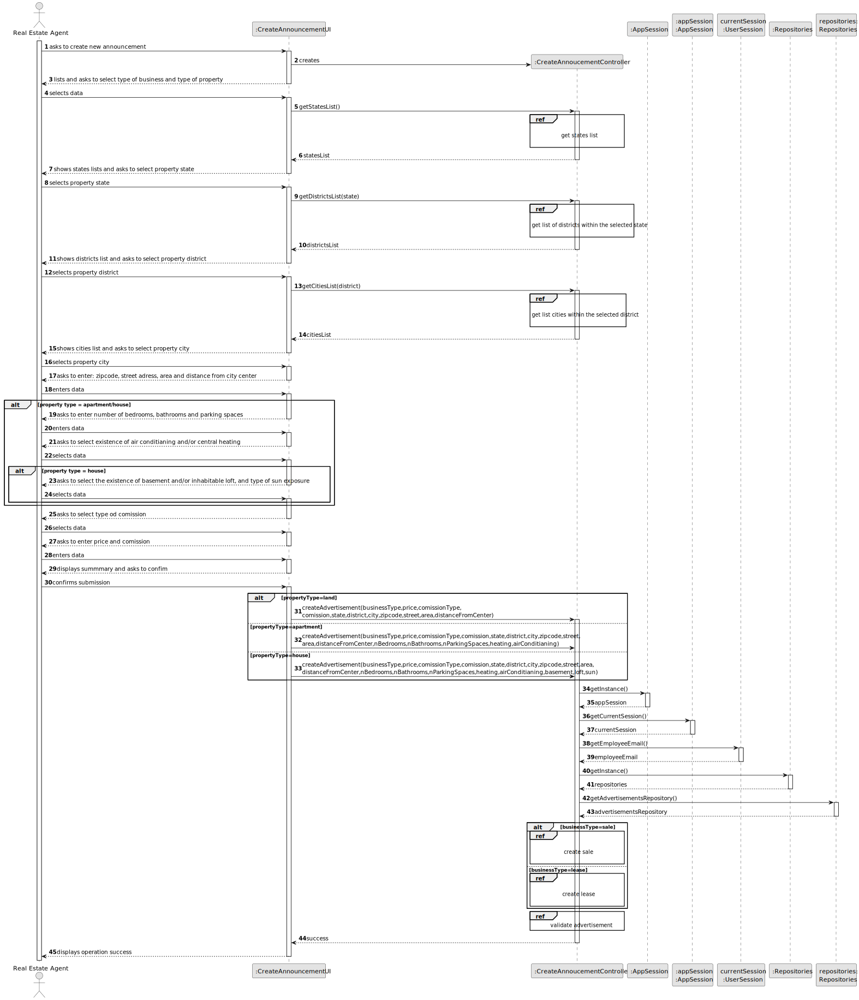
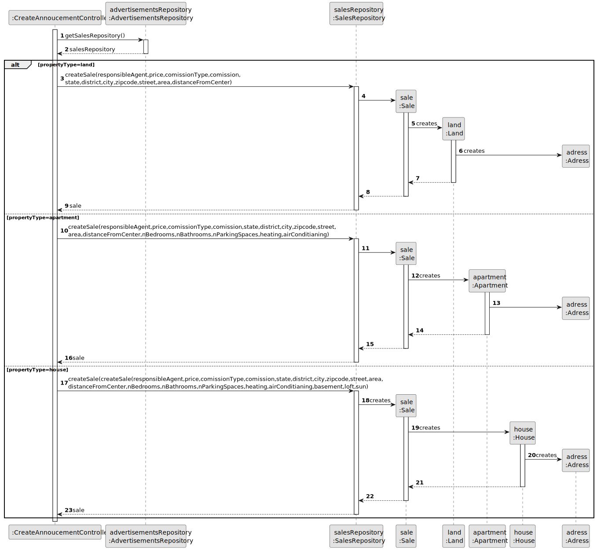
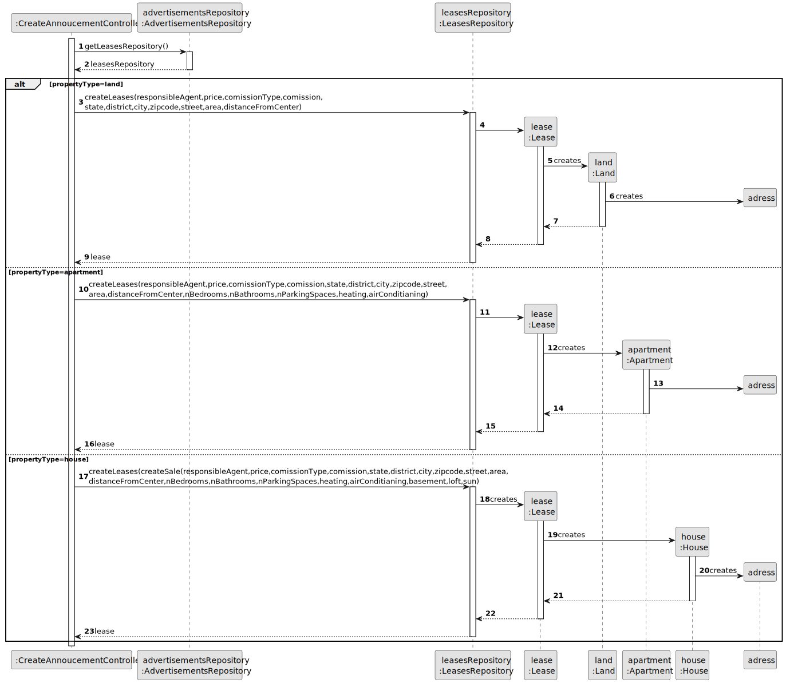
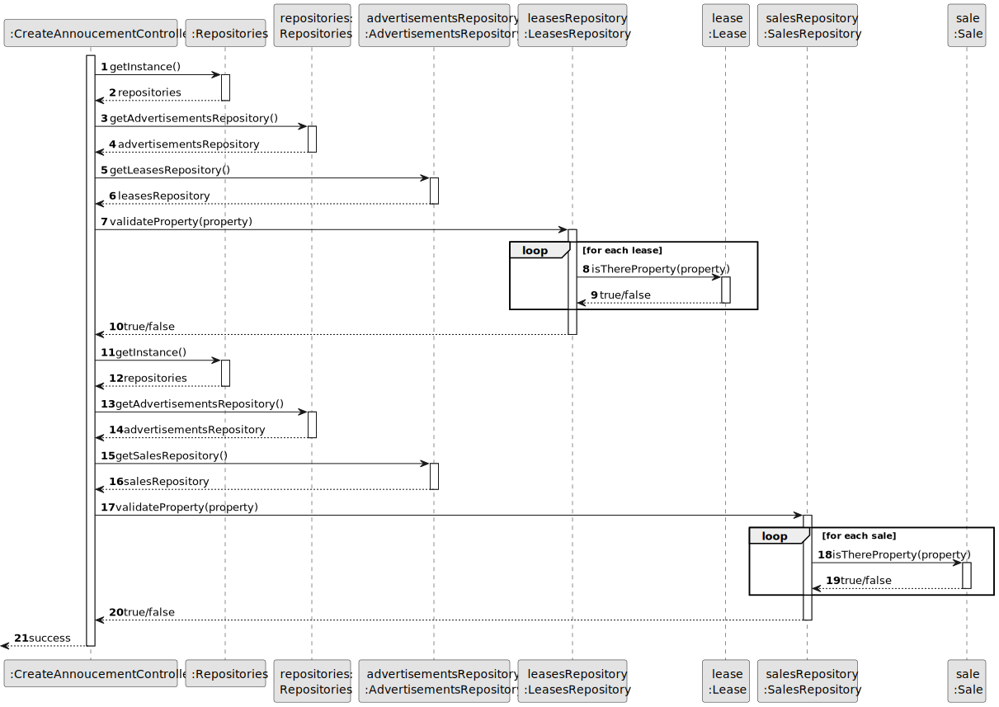
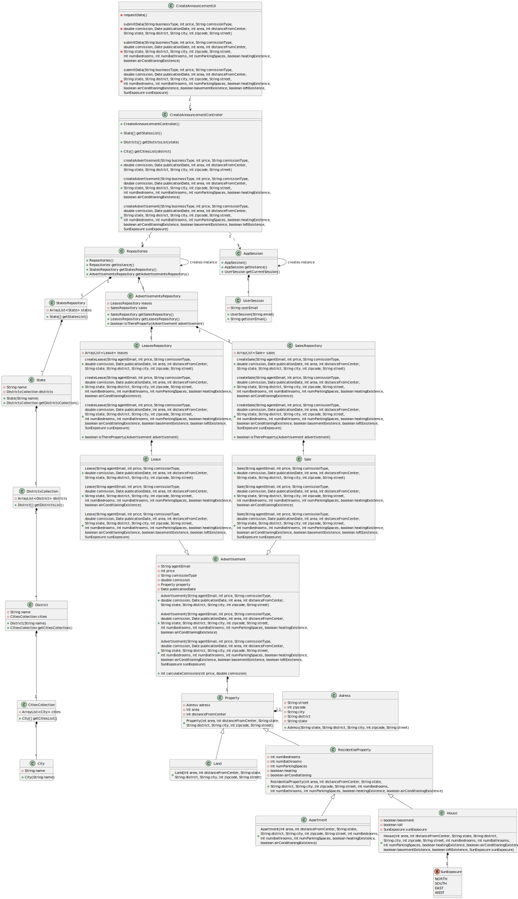

# US 002 - To publish an announcement

## 3. Design - User Story Realization 

### 3.1. Rationale

**SSD - Alternative 1 is adopted.**

| Interaction ID | Question: Which class is responsible for...                       | Answer                       | Justification (with patterns)                                |
|:---------------|:------------------------------------------------------------------|:-----------------------------|:-------------------------------------------------------------|
| Step 1  		     | 	...interacting with the actor?                                   | CreateAnnouncementUI         | Pure Fabrication                                             |
| Step 2         | ...managing the system resources and delegating taks              | CreateAnnouncementController | Controller                                                   |
| Step 3         | ...temporarly saving the inputted data                            | CreateAnnouncementUI         | Pure Fabrication                                             |
|        | ...getting the states list                                        | StatesRepository             | Information Expert                                           |
|                | ...sorting the states list by ascending alphabetical order        | StatesRepository             | Information Expert                                           |
| Step 5         | ...getting the list of the districts inside of the selected state | DistrictsCollection          | Information Expert                                           |
|                | ...sorting the districts list by ascending alphabetical order     | DistrictsCollection          | Information Expert                                           |
| Step 7         | ...getting the list of cities inside of the district selected     | CitiesCollection             | Information Expert                                           |
|                | ...sorting the cities list by ascending alphabetical order        | CitiesCollection             | Information Expert                                           |
| Step 11        | ...validating the ACs for inputted data                           | CreateAnnoucementUI          | Pure Fabrication                                             |
| Step 23        | ...creating the lease advertisement                               | LeasesRepository             | Creator (rule 1: contains/aggregates instances of the class) |
|                | ...creating the sale advertisement                                | SalesRepository              | Creator (rule 1: contains/aggregates instances of the class) |
|                | ...creating the property                                          | Sale/Lease                   | Creator (rule 1: contains/aggregates instances of the class)                                                         |
|                | ...creating the adress                                            | Property                     | Creator (rule 1: contains/aggregates instances of the class)                                                             |

### Systematization ##

According to the taken rationale, the conceptual classes promoted to software classes are: 

* Sale
* Lease
* Property

Other software classes (i.e. Pure Fabrication) identified: 

 * CreateAnnouncementUI  
 * CreateAnnouncementController
 * StatesRepository
 * DistrictsCollection
 * CitiesCollection
 * SalesRepository
 * LeasesRepository

## 3.2. Sequence Diagram (SD)

### Split Diagram

### Get States List

### Get Districts Within State

### Get Cities Within District

### Create Sale

### Create Lease

### Validate Advertisement

## 3.3. Class Diagram (CD)

