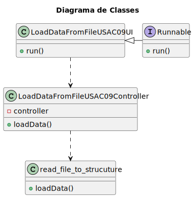

# US AC09

## 1. Engenharia de Requisitos

### 1.1 Descrição da User Story

> Desenvolva uma função que insira os dados recebidos do compoente ColetorDeDados nas estruturas de dados

### 1.2. Especificações e Clarificações 

###  Clarificações Professores

* N/A

#### Clarificações Cliente

* N/A


#### 1.3 Critérios de Aceitação

* N/A

---
### 1.4 Dependências

* Precisa de um ficheiro com os dados das medições das temperaturas, humidade e humidade do solo.

### 1.5 Dados de Input e Output

**Input Data**

* Dados das medições

**Selected data:**

* N/A

**Output Data**

*  Dados guardados na estrutura

### 1.6 Diagrama de Sequência de Sistema

 

### 1.7 Outros pontos importantes

* N/A
---
## 2. Análise

### 2.1 Modelo Domínio Parcial


---
## 3. Design

Classes conceptuais que foram promovidas a classes de software:

* read_data_to_structure.c
* main.c

Outras classes:
* UI
* CONTROLLER

## 3.1 Diagrama de Classes

---
## 4. Testes

* N/A
---
## 5. Implementação

### main.c

```c
int main() {
    
    FILE *file = fopen("sensores.txt", "r");
    
    if (file == NULL) {
        perror("Erro ao abrir o arquivo");
        return 1;
    }

    // Chamar a função para ler o arquivo e imprimir os dados
    loadData(file);

    // Fechar o arquivo
    fclose(file);
    
    return 0;
}
```

### read_data_to_structure.c

```c
void loadData(FILE *file) {
	
    char linha[1000];
    struct SensorData dados;

    while (fgets(linha, sizeof(linha), file) != NULL) {
		
        char *token = strtok(linha, " \t\n");

        while (token != NULL) {
			
            if (strncmp(token, "sensor_id:", 10) == 0) {
                dados.sensor_id = atoi(token + 10);
                
            } else if (strncmp(token, "type:atmospheric_temperature", 27) == 0) {
                dados.tipo = ATMOSPHERIC_TEMPERATURE;
                
            } else if (strncmp(token, "type:atmospheric_humidity", 24) == 0) {
                dados.tipo = ATMOSPHERIC_HUMIDITY;
                
            } else if (strncmp(token, "type:soil_humidity", 18) == 0) {
                dados.tipo = SOIL_HUMIDITY;
                
            } else if (strncmp(token, "valor:", 6) == 0) {
                dados.valor = atof(token + 6);
                
            } else if (strncmp(token, "time:", 5) == 0) {
                dados.time = atoi(token + 5);
            }

            token = strtok(NULL, " \t\n");
        }

        switch (dados.tipo) {
			
            case ATMOSPHERIC_TEMPERATURE:
                printf("Tipo: ATMOSPHERIC_TEMPERATURE\n");
                break;
                
            case ATMOSPHERIC_HUMIDITY:
                printf("Tipo: ATMOSPHERIC_HUMIDITY\n");
                break;
                
            case SOIL_HUMIDITY:
                printf("Tipo: SOIL_HUMIDITY\n");
                break;
        }

        printf("Sensor ID: %d\n", dados.sensor_id);
        printf("Valor: %.2f %%\n", dados.valor);
        printf("Tempo: %d\n", dados.time);
        printf("\n");
    }

```

### usac09.h

```c
#ifndef USAC09_H
#define USAC09_H

enum TipoDado {
    ATMOSPHERIC_TEMPERATURE,
    ATMOSPHERIC_HUMIDITY,
    SOIL_HUMIDITY
};

struct SensorData {
    int sensor_id;
    enum TipoDado tipo;
    float valor;
    int time;
};

void loadData(FILE *fileName);

#endif

```

### Makefile

```c
INCLUDES = usac09.h

SOURCES = main.c read_data_to_structure.c

OBJFILES = main.o read_data_to_structure.o

EXEC = usac09

.SUFFIXES : .c .o .s

.c.o:
	gcc -Wall -g -c $<
	
${EXEC}: ${OBJFILES}
	gcc -Wall -g -o ${EXEC} ${OBJFILES}

${OBJFILES}: ${SOURCES} ${INCLUDES}

run: ${EXEC}
	./${EXEC}

clean:
	rm -f ${OBJFILES} ${EXEC}

debug: ${EXEC}
	gdb -tui ${EXEC}

```