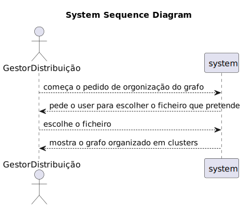

# US EI09

## 1. Engenharia de Requsitos

### 1.1 Descrição da User Story

*  - Organizar as localidades do grafo em N clusters que garantam apenas 1 hub por cluster de localidades. Os clusters
     devem ser obtidos iterativamente através da remoção das ligações com o maior número de caminhos mais curtos entre 
     localidades até ficarem clusters isolados.

### 1.2. Especificações e Clarificações

Clarificações do Cliente:

* N/A

Clarificações dos Professores:

> *Pergunta: "tendo em conta a seguinte frase do enunciado "Organizar as localidades do grafo em N clusters que garantam 
             apenas 1 hub por cluster de localidades." podemos assumir que, após o surgimento dos N clusters, quaisquer outros 
             hubs que não estejam no conjunto N, não devem ser inseridos em nenhum cluster? 
             Esta dúvida surge, pois noutra pergunta referente à USEI09, a professora respondeu que um cluster deve 
             ter "pelo menos" um hub."

    * Resposta: "Um cluster deve ter pelo menos um hub, mas pode ter mais do que um hub. A segmentação ou os clusters 
      devem incluir todas as localidades/hubs, não devem ficar com localidades/hubs isolados."

> *Pergunta: "Gostaria de lhe pedir que explicasse, com pormenor, o conceito de cluster e também o conceito de isolação."

    * Resposta: "Nesta US tem de receber o nº de clusters por parâmetro e depois ir removendo os ramos do grafo que apresentem o maior nº de caminhos mínimos a passar por eles ( betweenness do ramo)

    Fazer
    1. Calcular o nº de caminhos mínimos que passam em cada ramo = betweenness do ramo
    2. Remover o(s) ramo(s) com maior
    Até se obter o nº de clusters pretendido.

    Ter em atenção que cada cluster deve ter pelo menos 1 hub."
    
### 1.3. Critérios de Aceitação

* AC01: Devolver lista de Hubs e o respetivo conjunto de localidades que pertencem ao cluster desse Hub.
* AC02: Não deverá fornecer soluções de clusters de localidades sem o respetivo hub.


### 1.4. Dependedências

* Dependência de US EI01, pois o grafo ja tem de estar carregado para que a funcionalidade funcione

### 1.5 Dados de Input e Output

**Input Data**

* N/A

**Selected data:**

* Opção de Ficheiro small ou ficheiro big

**Output Data**

* Grafo com clusters


### 1.6. Diagrama de Sequência de Sistema (SSD)





### 1.7 Outros Pontos Importantes 

* N/A

## 2. Analise

### 2.1. Excerto Modelo Domínio

* N/A

### 2.2. Outros Pontos

* N/A

## 3. Design

Classes conceptuais que foram promovidas em classes de software:
* OrganizeGraphIntoClusters

Outras classes:
* OrganizeGraphIntoClustersUI
* OrganizeGraphIntoClustersController

## 3.2. Diagrama de Sequência (SD)


## 3.3. Diagrama de Classes (CD)


---
# 4. Testes

**Test 1:** 

---
# 5. Implementação

### Nome da classe

```java


```

---