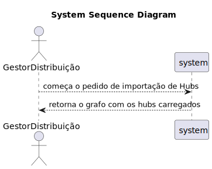

# US EI09

## 1. Engenharia de Requsitos

### 1.1 Descrição da User Story

*  - Como Product Owner pretendo carregar um ficheiro com os horários de funcionamento de uma lista de hubs.

### 1.2. Especificações e Clarificações

Clarificações do Cliente:

* N/A

Clarificações dos Professores:

*N/A
    
### 1.3. Critérios de Aceitação

* AC01: Caso os hubs já existam, os horários devem ser redefinidos, caso contrário deve ser emitida uma mensagem de erro.

### 1.4. Dependedências

* Dependência de US EI01, pois o grafo ja tem de estar carregado para que a funcionalidade funcione
* Um ficheiro com oh hubs deve ser defenido antes de usar a funcionalidade

### 1.5 Dados de Input e Output

**Input Data**

* N/A

**Selected data:**

* N/A

**Output Data**

* Successo ou não da operação


### 1.6. Diagrama de Sequência de Sistema (SSD)





### 1.7 Outros Pontos Importantes 

* N/A

## 2. Analise

### 2.1. Excerto Modelo Domínio

* N/A

### 2.2. Outros Pontos

* N/A

## 3. Design

Classes conceptuais que foram promovidas em classes de software:

* LoadHubsFromFile

Outras classes:

* LoadHubsFromFileUI
* LoadHubsFromFileController

## 3.2. Diagrama de Sequência (SD)


## 3.3. Diagrama de Classes (CD)


---
# 4. Testes

**Test 1:** 
```java
    
        

```

---
# 5. Implementação


### LoadHubsFromFileController

```java
public class LoadHubsFromFileController {

    public LoadHubsFromFileController() {

    }

    public boolean loadHubs() {

        LoadHubsFromFile hubs = new LoadHubsFromFile();
        return hubs.loadHubsFormFile();
    }
}

```

### LoadHubsFromFileUI

```java
public class LoadHubsFromFileUI implements Runnable {

    private LoadHubsFromFileController controller;

    @Override
    public void run() {

        System.out.println("Carregar Hubs do Ficheiro");

        if (controller.loadHubs()) {

            System.out.println("Ficheiro carregado com successo");

        } else {

            System.out.println("Não foi possível carregar o ficheiro");
        }
    }
}

```

### LoadHubsFromFile

```java
public class LoadHubsFromFile {

    public boolean loadHubsFormFile() {

        GraphStore graphStore = Repositories.getInstance().getGraphStore();

        try {

            BufferedReader bufferedReader = new BufferedReader(new FileReader("hubs.txt"));

            String line;
            boolean isFirstLine = true;

            while ((line = bufferedReader.readLine()) != null) {

                if (isFirstLine) {

                    isFirstLine = false;
                    continue;
                }

                String[] parts = line.split(",");
                String locId = parts[0];

                LocalTime openingHours = LocalTime.parse(parts[1]);
                LocalTime closingHours = LocalTime.parse(parts[2]);

                Schedule schedule = new Schedule(openingHours, closingHours);
                Hub hub = new Hub(locId, schedule);

                if (graphStore.getGraph().validVertex(hub)) {

                    graphStore.addVertex(hub);
                }
                return true;
            }

        } catch (IOException ioException) {

            System.err.println("Ficheiro não encontrado");
            return false;

        } catch (Exception e) {

            System.err.println(e.getMessage());
        }
        return false;
    }
}

```

---