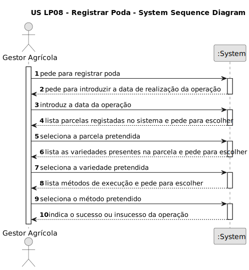

# US EI06 - Encontrar percursos entre um local e um hub

## 1. Requisitos

### 1.1. Descrição da US

Encontrar para um produtor os diferentes percursos que consegue fazer entre um local de origem e um hub, limitados pelos quilômetros de autonomia do seu veículo elétrico, ou seja, não considerando carregamentos no percurso.

### 1.2. Especificações e esclarecimentos do Product Owner:

**Do documento de especificações:**

> Os produtores são as entidades que produzem produtos agrícolas e os vendem em cabazes. Isso significa que podem existir produtores mais focados em frutas ou hortícolas, bem como na produção de derivados de animais, como ovos, carne e leite.

> Os hubs são as instituições/empresas nas quais são entregues cabazes, posteriormente levantados pelos clientes. Os hubs podem ser universidades, hospitais, ginásios e empresas, e têm um período de funcionamento para entrega e levantamento de cabazes (em princípio, não coincide com o horário de funcionamento da instituição).

**De esclarecimentos do cliente:**

> Nenhuma.

### 1.3. Critérios de aceitação

* **AC1:** Devolver para cada percurso o local de origem, os locais de passagem (sendo um hub, identificá-lo), distância entre todos os locais do percurso, distância total e tempo total de percurso.

### 1.4. Dependências identificadas

* **USEI02** - Determinar os vértices ideais para a localização de N hubs de modo a otimizar a rede de distribuição segundo diferentes critérios.

### 1.5 Dados de entrada e de saída

**Inputs:**

>* **Dados introduzidos:**
>  * autonomia do veículo em (km)
>  * velocidade do veículo em (km/h)

>* **Dados selecionados:**
>  * local de origem
>  * hub de destino

**Outputs:**

> * Todos os percursos indicando os locais de passagem (sendo um hub, identificá-lo), distância entre todos os locais do percurso, distância total e tempo total de percurso.

### 1.6. System Sequence Diagram (SSD)

### 1.7 Observações relevantes

Nenhuma.