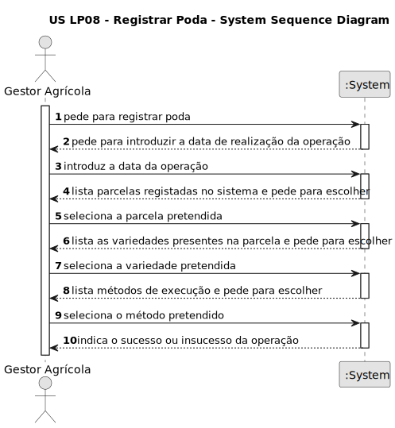

# US LP08 - REGISTRAR PODA

## 1. Requisitos

### 1.1. Descrição da US

Como Product Owner, pretendo que sejam desenvolvidas funcionalidades que permitam a evocação da USBD15: "Como Gestor Agrícola, desejo registrar uma operação de poda".

### 1.2. Especificações e esclarecimentos do Product Owner:

**Do documento de especificações:**

> **Operação Agrícola** - é toda a ação que é desenvolvida no contexto da atividade agrícola, designadamente: semear, plantar, podar, mondar, desfolhar, tutorar, regar, fertilizar, colher. As operações são usualmente realizadas por operadores frequentemente auxiliados por máquinas e instrumentos agrícolas (como tratores ou tesouras de poda). Podem implicar a utilização de fatores de produção. As operações agrícolas são realizadas ao longo do ano, normalmente em função do estado fenológico da cultura e de acordo com uma sequência lógica. De notar que existem operações que são realizadas sobre parcelas nas quais podem não estar instaladas culturas (por exemplo, preparação de solo antes de uma semeadura).

> Os estados fenológicos são determinantes para a realização das operações agrícolas.

**De esclarecimentos do cliente:**

>**Questão:** Para inserir uma operação na base de dados é necessário o tipo de operação (colheita, poda, etc...), esta US consiste em adicionar uma operação de aplicação de fator produção, o que é que colocamos como tipo de operação?
> - Usamos um nome igual independentemente do tipo de fator de produção aplicado (Ex.: "Aplicação de um fator de produção")?
> - Usamos um nome que depende do tipo de fator de produção aplicado (Ex.: Fertilização caso seja um fertilizante)?
> - Usamos um nome que será posteriormente inserido pelo utilizador?
>
>**Resposta:** Não vou responder à questão, mas sugeria que perguntas sobre aspetos técnicos de US específicas de BDDAD faz mais sentido serem colocadas no forum de questões relacionadas com BDDAD. Não consigo perceber bem a sua questão, pelo que fico com dúvidas se não será antes sobre a US de LAPR3 correspondente, a USLP07, nomeadamente a forma como se pretende implementar a interação com o utilizador.

>**Questão:** Nos dados legacy, as diferentes Plantas têm informações relativas aos seus periodos ideais para Poda, Floração, Colheita e Sementeira/Plantação.
> Será necessário utilizar esta informação para realizar alguma análise das Plantas, ou podemos assumir que é meramente informativa.
>
>**Resposta:** A indicação dos períodos previstos diz respeito à realização de operações agrícolas (por exemplo, poda) e estado fenológico das plantas (por exemplo, floração). As operações agrícolas e estados fenológicos estão intimamente ligados e é importante a sua compreensão para a construção/actualização adequada dos artefactos que capturam a informação do domínio do problema. No entanto, são as USs que determinam a necessidade de modelar estes aspectos nos diferentes níveis de abstracção (conceptual, lógico, ...), enquanto não forem necessários em qualquer US, podem ser considerados "informativos".

>**Questão**: Dentre as seguintes operações agrícolas: poda, tutoramento e desfolha, alguma delas é específica de culturas permanentes ou temporárias?
>
>**Resposta**: O cliente não conhece todas as culturas para responder taxativamente a essa questão. Embora algumas das operações sejam mais comuns num tipo ou outro, creio que será mais prudente assumir que as operações são válidas para ambos os tipos.

### 1.3. Critérios de aceitação

* **AC1:** A parcela em que foi feita poda deve existir no sistema
* **AC2:** A variedade em que foi feita a poda deve estar registada no sistemad
* **AC3:** A variedade em que foi feita a poda deve existir na parcela 
* **AC4:** Não é permitido o registo de operações com datas no futuro

### 1.4. Dependências identificadas

* **USBD15** - Como Gestor Agrícola, desejo registrar uma operação de poda.

### 1.5 Dados de entrada e de saída

**Inputs:**

>* **Dados introduzidos:**
>  * quantidade tratada na poda
>  * data da operação
>
> 
>* **Dados selecionados:**
>  * id da parcela
>  * id da variedade
>  * id do método de execução

**Outputs:**

* Sucesso/insucesso da operação

### 1.6. System Sequence Diagram (SSD)

### 1.7 Observações relevantes

Nenhuma.