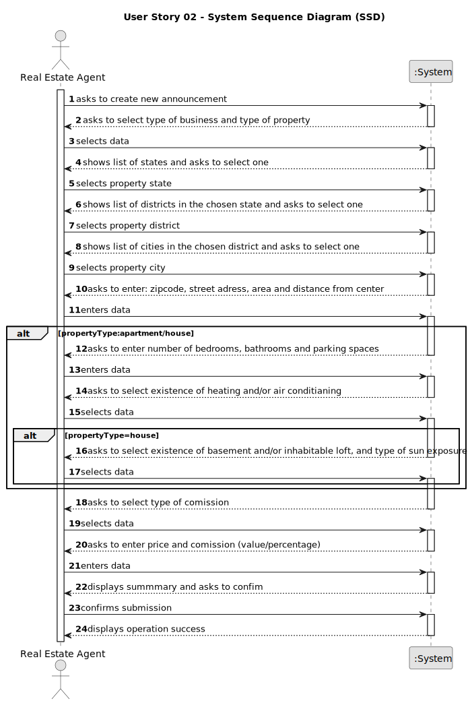

# US 008 - Evocação da USBD15

## 1. Requisitos

### 1.1. Descrição da US

Como Product Owner, pretendo que sejam desenvolvidas funcionalidades que permitam a evocação da USBD15.

### 1.2. Especificações e especificações do Product Owner

**Do documento de especificações:**

> **Operação Agrícola** - é toda a ação que é desenvolvida no contexto da atividade agrícola, designadamente: semear, plantar, podar, mondar, desfolhar, tutorar, regar, fertilizar, colher. As operações são usualmente realizadas por operadores frequentemente auxiliados por máquinas e instrumentos agrícolas (como tratores ou tesouras de poda). Podem implicar a utilização de fatores de produção. As operações agrícolas são realizadas ao longo do ano, normalmente em função do estado fenológico da cultura e de acordo com uma sequência lógica. De notar que existem operações que são realizadas sobre parcelas nas quais podem não estar instaladas culturas (por exemplo, preparação de solo antes de uma semeadura).

> Os estados fenológicos são determinantes para a realização das operações agrícolas.

**De esclarecimentos do cliente:**

>**Questão:** Para inserir uma operação na base de dados é necessário o tipo de operação (colheita, poda, etc...), esta US consiste em adicionar uma operação de aplicação de fator produção, o que é que colocamos como tipo de operação?
> - Usamos um nome igual independentemente do tipo de fator de produção aplicado (Ex.: "Aplicação de um fator de produção")?
> - Usamos um nome que depende do tipo de fator de produção aplicado (Ex.: Fertilização caso seja um fertilizante)?
> - Usamos um nome que será posteriormente inserido pelo utilizador?
>
>**Resposta:** Não vou responder à questão, mas sugeria que perguntas sobre aspetos técnicos de US específicas de BDDAD faz mais sentido serem colocadas no forum de questões relacionadas com BDDAD. Não consigo perceber bem a sua questão, pelo que fico com dúvidas se não será antes sobre a US de LAPR3 correspondente, a USLP07, nomeadamente a forma como se pretende implementar a interação com o utilizador.

>**Questão:** Nos dados legacy, as diferentes Plantas têm informações relativas aos seus periodos ideais para Poda, Floração, Colheita e Sementeira/Plantação.
> Será necessário utilizar esta informação para realizar alguma análise das Plantas, ou podemos assumir que é meramente informativa.
>
>**Resposta:** A indicação dos períodos previstos diz respeito à realização de operações agrícolas (por exemplo, poda) e estado fenológico das plantas (por exemplo, floração). As operações agrícolas e estados fenológicos estão intimamente ligados e é importante a sua compreensão para a construção/actualização adequada dos artefactos que capturam a informação do domínio do problema. No entanto, são as USs que determinam a necessidade de modelar estes aspectos nos diferentes níveis de abstracção (conceptual, lógico, ...), enquanto não forem necessários em qualquer US, podem ser considerados "informativos".

### 1.3. Acceptance Criteria

* **AC1:** All required data are mandatory, except number of bathrooms, available equipment, and sun exposure
* **AC2:** Only alphanumeric characters and diacritics (accents) are allowed for street adress.
* **AC3:** Zipcode, area, distance from city center, number of bedrooms, number of bathroooms, number of parking spaces, price and comission value must be integer numbers. 
* **AC4:** The comission percentage must be a non-negative number.

### 1.4. Found out Dependencies

* None

### 1.5 Input and Output Data

**Input Data:**

>* **Typed data:**
>  * area in m2
>  * distance from the city center
>  * street adress
>  * zipcode
>  * price
>  * comission (value/percentage)
>  * Additional data for Apartments and Houses:
>    * number of bedrooms
>    * number of bathrooms
>    * number of parking spaces
>
>
>* **Selected data:**
>  * type of business (sale/lease)
>  * type of property
>  * property state
>  * property district
>  * property city
>  * type of comission (amount/percentage)
>  * Additional data for Apartments and Houses:
>    * existence of central heating
>    * existence of air conditianing
>  * Additional data for Houses exclusively:
>    * existence of basement
>    * existence of inhabitable loft
>    * direction of sun exposure

**Output Data:**

* Summary of the inputted data
* Success/Insucess of submission

### 1.6. System Sequence Diagram (SSD)

### 1.7 Other Relevant Remarks

None.